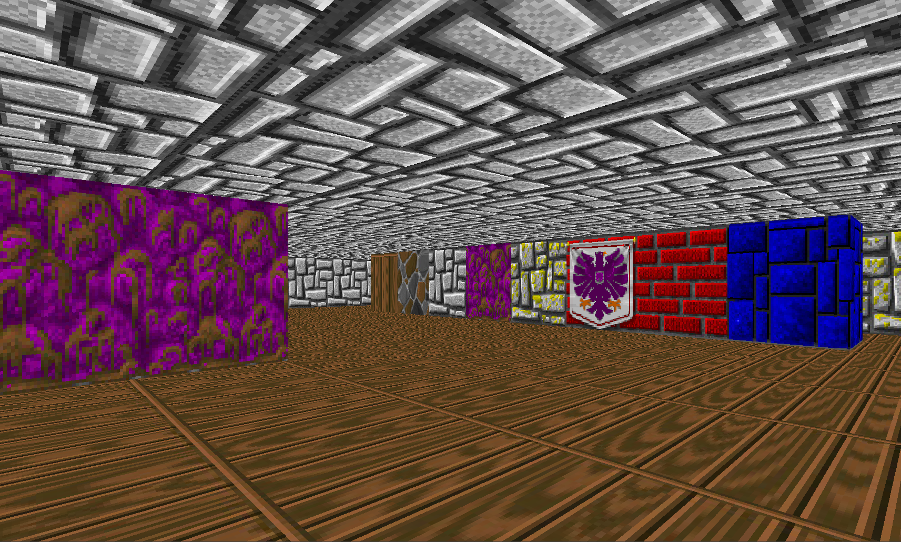

# Wolfenstein Raycaster *(via SDL3)*

- A simple in-progress ray-casting engine made using SDL3

## TODO

- [ ] Refactoring
  - [x] `unique_ptr` wrappers to every thin, raw pointer
  - [x] abstractions, encapsulation etc.
  - [x] General refactoring
  - [ ] Fix broken texture parsing? writing? reading?
- [ ] Entities
- [ ] Advanced levels (optional)
- [ ] Advanced graphics -> lighting, shadows, fog

- [x] Fundamentals, Base Engine
- [x] Textures
- [x] Floor & Ceiling rendering
- [x] Color Correction
- [x] Rewrite and refactor
- [x] Map editor
  - [x] Terminal Editor
  - [x] Convert map mData to 1D array
  - [x] Create map through the render pipeline used for the game
  - [x] Add the ability to scroll through segments and change
  - [x] Abstractions and refactoring
- [x] Fix concurrency issue with map editor and game running together
