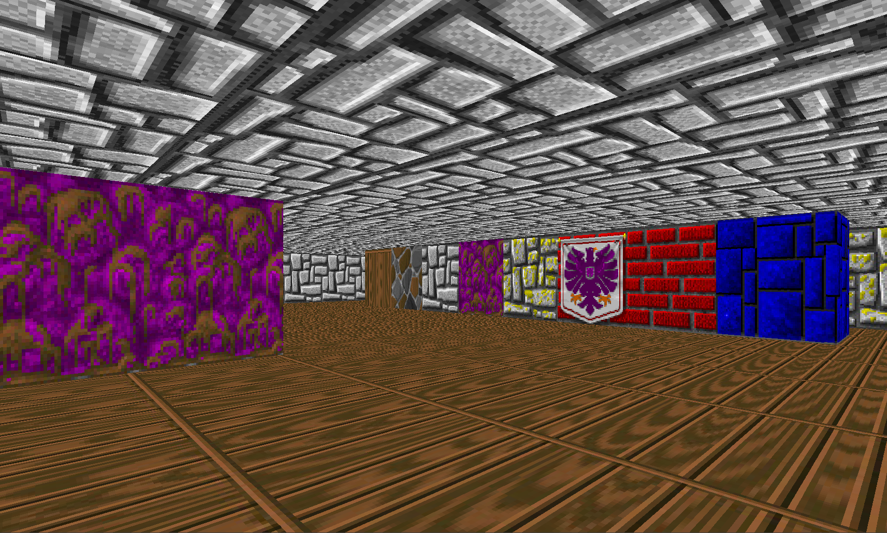

# Wolfenstein Raycaster *(via SDL3)*

- A simple still-in-progress ray-casting engine made using SDL3

## TODO

- [x] Fundamentals, Base Engine
- [x] Textures
- [ ] Floor & Ceiling rendering
- [ ] Map editor
  - [x] Terminal Editor
  - [ ] ImGui Editor
- [ ] Advanced graphics -> lighting, shadows, fog
